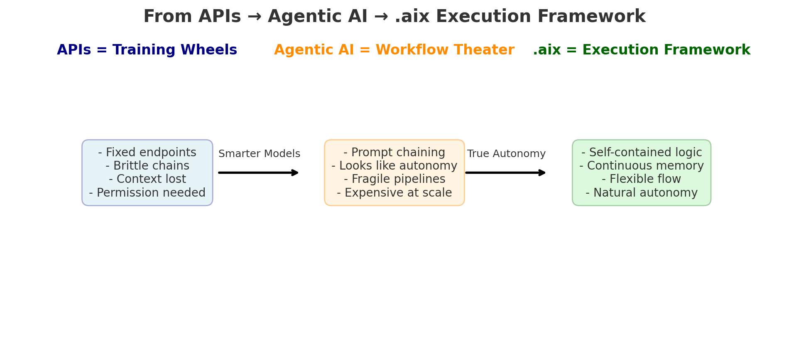
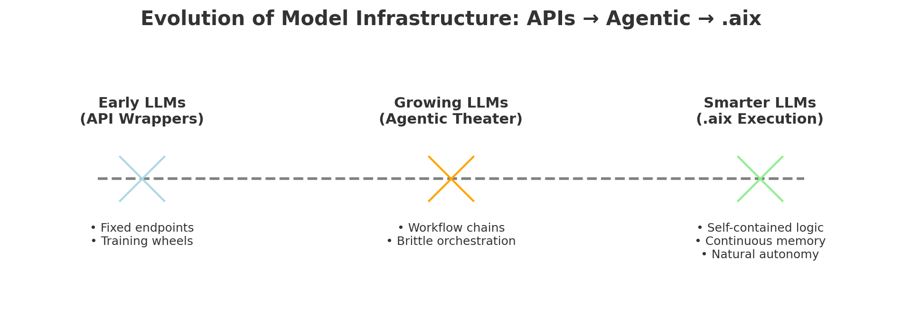

# 🚲 APIs Were Training Wheels, .aix Is the Execution Framework
*From brittle APIs and prompt-chained “agents” → to a portable, auditable **execution layer**.*

<!-- Full-size image -->

<!-- If you want it smaller on GitHub, use this instead:

  

-->

Large language models are evolving fast — but the way we *execute* them hasn’t kept up.  
Today’s systems rely on APIs and “agentic AI” frameworks that look impressive, but are brittle, slow, and hard to trust at scale.  
What’s missing is an **execution layer** — a standard for packaging logic, memory, and persona into a portable, auditable format.

That’s the role of **.aix**.

---

## 🕰️ Where We’ve Been

### 1. APIs = Training Wheels
- Clear, rigid endpoints  
- Easy to script: call AI → get response → continue loop  
- Good for weak models, but limiting for strong ones  
- **Problem:** APIs are stateless, brittle, and force models into tiny boxes

> APIs were training wheels — useful early on, but constraining once models are strong enough to ride on their own.

---

### 2. Agentic AI = Workflow Theater
The term *Agentic AI* is often misapplied.

- **True definition:** Agents that can **reason, plan, and act autonomously**, with continuity of memory and identity.  
- **Current usage (hype):** Prompt-chained orchestration — models calling APIs in loops, marketed as “autonomy.”  
  - Example: Call LLM → get response → feed into next API → repeat.  
  - Looks like autonomy, but collapses under complexity.

**Problems with today’s “agentic AI”:**
- Stateless, ephemeral runs  
- Loses context/persona between steps  
- Expensive and fragile at scale

---

## 🚀 Where We’re Going: .aix **Execution Layer**
.aix introduces a **true execution layer** for AI.  
Instead of brittle prompt chains, .aix packages an agent’s **logic, memory, and persona** into a portable container.

### ✅ What .aix Enables
- Self-contained logic + scoped state  
- Continuous memory with fallback rules  
- Auditable and reproducible execution  
- Portable across GPT, LLaMA, Grok, or edge devices

### 🌐 Why It Matters
If agentic AI is to fulfill its *true definition* (autonomous, auditable, persistent systems),  
it requires more than APIs — it requires an **execution layer**.

That standard is **.aix**.

---

## 📊 Evolution of Model Infrastructure

- APIs were the training wheels.  
- Agentic AI (today’s hype) is the interim crutch.  
- .aix is the **execution layer** that smarter models demand.

---

## 🔬 Why This Matters
As models scale, APIs don’t empower them — they handicap them.  
Just as **VCF became the backbone of genomics**, .aix can become the backbone of AI execution:

- Open for research and creativity  
- Commercially fair for enterprise use  
- Standardized for trust, portability, and compliance

---

👉 **Explore the repos**
- [Agentic AI: Missing Pieces](https://github.com/mjtiv/AgenticAI_MissingPieces)  
- [.aix File Format](https://github.com/mjtiv/aix-file-format)  
- [.aix Demos](https://github.com/mjtiv/aix-demos)

---

⚡ **Discussion Prompt**  
Are APIs enough for smarter models — or is it time to embrace an **execution layer like .aix**?
